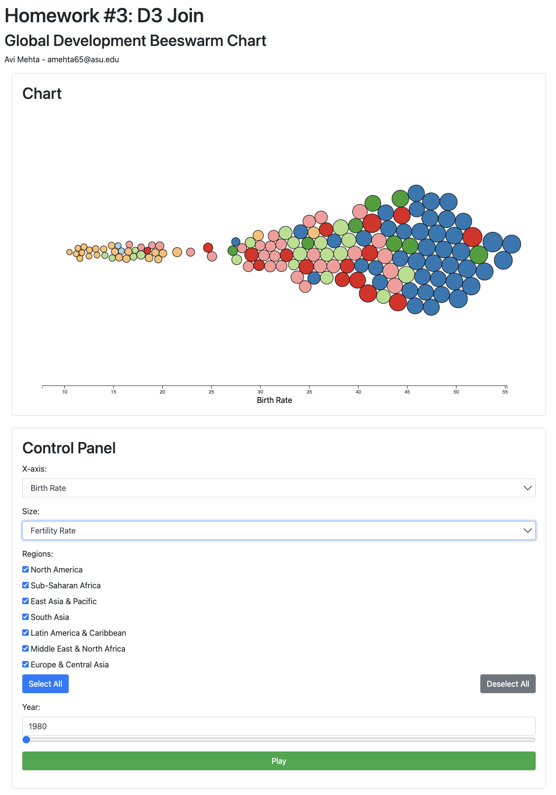

# Global Development Beeswarm Chart

This project demonstrates an interactive data visualization using D3.js, showcasing a beeswarm chart that dynamically represents various aspects of global development. The visualization allows users to explore data across different countries, years, and development indicators, providing insights into trends and patterns in global development metrics.

## Overview



## Features

- **Dynamic Beeswarm Chart**: Visualize global development data as an interactive beeswarm chart.
- **Customizable Data Representation**: Choose different attributes for the x-axis and circle size, showcasing various development indicators.
- **Interactive Year Selection**: Browse through data by selecting different years or using a playback feature for animated transitions.
- **Region Selection**: Filter data by world regions, with options to select or deselect all regions.
- **Responsive Tooltip**: Hover over data points to view detailed information about each country, including the country's name, values for the x-axis and size attributes, and a representative image or icon.
- **Data Filtering**: Dynamically update the visualization based on user-selected criteria, such as regions, attributes, and years.
- **Staggered Animations**: Smooth transitions and animations provide a clear view of changes over time or when adjusting parameters.

## Technologies

- **D3.js**: Used for creating and manipulating the data-driven visualization.
- **HTML/CSS**: Structure and styling of the web page and controls.
- **JavaScript**: For handling interactivity and data processing.
- **Bootstrap**: For responsive design and styling of controls.

## Dataset

The project uses the Global Development dataset from the CORGIS database, featuring a wide range of development indicators from 1980 to 2013.

## Getting Started

1. **Clone the Repository**: Clone or download the project repository to your local machine.

    ```
    git clone https://github.com/AviMehta90/BeeSwarm-Viewer.git
    ```

2. **Open `index.html`**: Navigate to the project directory and open the `index.html` file in a web browser.

3. **Explore the Visualization**: Use the control panel to change the x-axis attribute, size attribute, regions, and year. Watch the beeswarm chart update dynamically.

4. **Interactive Playback**: Use the play/pause button to animate the chart through different years.

5. **Hover for Details**: Move your cursor over the circles in the beeswarm chart to view detailed information in a tooltip.

## Controls

- **X-axis Dropdown**: Select an attribute to be displayed on the x-axis.
- **Size Dropdown**: Choose an attribute to determine the size of the circles.
- **Region Selection**: Check or uncheck regions to filter the countries displayed.
- **Year Selection**: Select a year or use the slider to update the chart for that year.
- **Play/Pause Button**: Animate the beeswarm chart through the years.

## Design and Styling

The webpage and chart are styled for ease of use and clarity, providing a clean and intuitive interface for interacting with the data.


## Instructions to run via python

- Download the entire zip from this github repository and extract
- Create a local web server
  ```
  python -m http.server 3000
  ```
- Go to the webbrowser and enter [http://localhost:3000/index.html](http://localhost:3000/index.html)

---